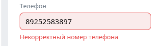
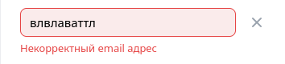
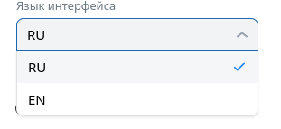
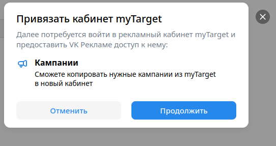
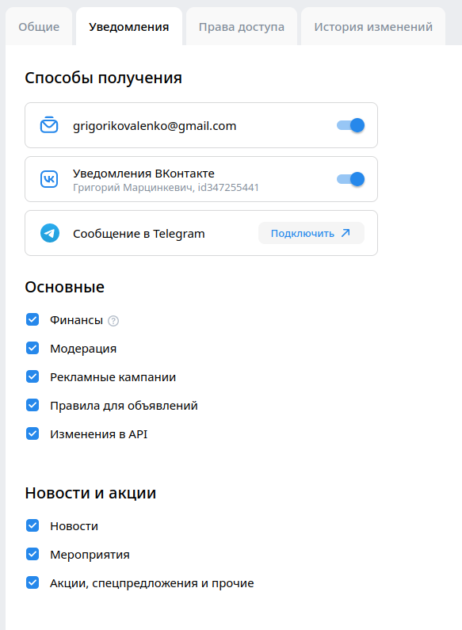
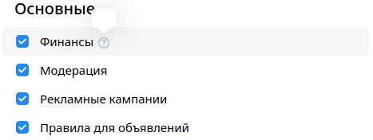
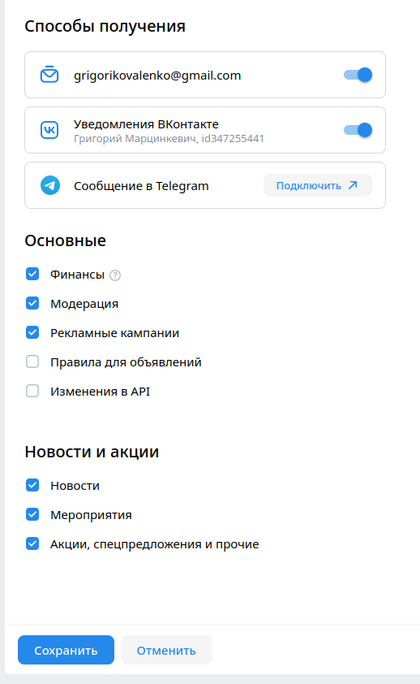

## Оглавление

1. [Настройки](#футер)
2. [Справка](#справка)
3. [Лид-формы](#лид-формы)
4. [Пополнение счета](#пополнение-счета)

## Настройки

- В настройках присуствуют:
    - Кнопка "общие", при нажатии ведет на https://id.vk.com/hq/settings
    - Кнопка "уведомления", при нажатии ведет на https://ads.vk.com/hq/settings/notifications
    - Кнопка "Права доступа", при нажатии ведет на https://ads.vk.com/hq/settings/access
    -  Кнопка "История изменений", при нажатии ведет на https://ads.vk.com/hq/settings/logs

- При неправильном вводе в поле номер телефона отображаются ошибки

- При нажатии на кнопку добавить email появляяется поле для ввода

- При некоретныйх данных в поле email выводится ошибка

- Меняется язык интерфейса

- При нажатии на кнопку "Привязать к MyTarget" появляется popup окно

- При переходе по подробнее о доступе появлется новое окно по url https://ads.vk.com/help/articles/help_api

## Уведомления 

- При нажатии на кнопку открывает окно с ссылкой на Vk-bot https://t.me/vkadssenderbot

- При наведение на впрос возле check-box Финансы доп информации не появлется

- При измении check-box настройку можно сохранить

## Новости 

- При нажатии на header "Новости" происходит редирект на страницу новостей https://ads.vk.com/news

- При нажатии на новость происходит отрытие новости по пути https://ads.vk.com/news/*

- Даты на картчке новсти совпадает с указанной в статье после redirect'а 

## Опросы

1. При клике на опросы открывается страница по адресу https://ads.vk.com/hq/leadads/surveys на которой отображается кнопка "Создать опрос" и таблица с полями: Название опроса, Статус, Список анкет, Количество анкет, Дата создания, ID.

2. При клике на кнопку "Создать опрос". Открывается страница "Новый опрос", полем "Название", "Название компании", "Заголовок опроса", "Описание опроса", а также окно выбора логотиипа "Логотип".

3. При клике на кнопку "Вопросы" у каждого поля появляется надпись "Обязательное поле". При клике на крест модального окна - окно закрывается.

4. При клике на кнопку "Создать опрос". Открывается страница модальное окно с названием "Новый опрос", полем "Название", "Название компании", "Заголовок опроса", "Описание опроса", а также окно выбора логотиипа "Логотип". Посел ввода кириллицы/латиницы/цифр во все поля для ввода и загрузке логотипа минимум 256x256px формата JPEG, PNG или GIF и клике на кнопку "Вопросы" открывается окно с заголовком "Вопросы" и кнопками: Добавить вариант, Добавить вопросю

5. При клике на кнопку "Назад" открывается предыдущая страница с введенными до этого данными. При клике на крест окно закрывается.

6. При клике на кнопку "Результат" появляется сообщение "Вопрос должен быть не пустым и содержать минимум 2 ответа". При клике на крест модального окна - окно закрывается.

7. При клике на кнопку "Добавить вариант" появляется новое поле "Введите ответ" и рядом с ним появляется крест. При клике на крест появившееся поле удаляется.

8. После ввода в вопрос и два поля вариантов ответа открывается страница "Результат" с двумя заполненными по умолчанию полями "Заголовок" с телом "Спасибо за ответы!" и "Описание" с телом "Заявка отправлена", а также кнопкой "Добавить ссылку".

9. При вводе символов в поле "Заголовок" больше 25 - счетчик символов становится красным.

10. При вводе символов в поле "Описание" больше 160 - счетчик символов становится красным.

11. При клике на "Запустить опрос" закрывается модальное окно "Новый опрос".

12. Отображается таблица опросов, которая в исходном состоянии сортирует параметр "Дата создания" по убыванию.

13. При клике на заголовок таблицы "ID" сортировка таблицы меняется на убывающую или возрастающую по "ID".

14. При наведении появляется дополнительное меню взаисодействия с запросом. Можно создать дубликат будет называться "имя + (копия)"

15. При наведении появляется дополнительное меню взаисодействия с запросом. Можно перейти на вкладку предпросмотра созданного опроса. Присутсвует новая вкладка с корректным url и окно опроса с кнопкой начать.
