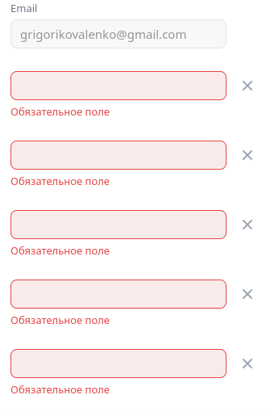

## Оглавление

1. [Настройки](#футер)
2. [Справка](#справка)
3. [Лид-формы](#лид-формы)
4. [Пополнение счета](#пополнение-счета)

## Настройки

- В настройках присуствуют:
    - Кнопка "общие", при нажатии ведет на https://id.vk.com/hq/settings
    - Кнопка "уведомления", при нажатии ведет на https://ads.vk.com/hq/settings/notifications
    - Кнопка "Права доступа", при нажатии ведет на https://ads.vk.com/hq/settings/access
    -  Кнопка "История изменений", при нажатии ведет на https://ads.vk.com/hq/settings/logs

- При неправильном вводе в поле номер телефона отображаются ошибки

- При нажатии на кнопку добавить email появляяется поле для ввода

- При некоретныйх данных в поле email выводится ошибка

- Меняется язык интерфейса

- При нажатии на кнопку "Привязать к MyTarget" появляется popup окно

- При переходе по подробнее о доступе появлется новое окно по url https://ads.vk.com/help/articles/help_api

## Уведомления 

- При нажатии на кнопку открывает окно с ссылкой на Vk-bot https://t.me/vkadssenderbot

- При наведение на впрос возле check-box Финансы доп информации не появлется

- При измении check-box настройку можно сохранить

## Новости 

- При нажатии на header "Новости" происходит редирект на страницу новостей https://ads.vk.com/news

- При нажатии на новость происходит отрытие новости по пути https://ads.vk.com/news/*

- Даты на картчке новсти совпадает с указанной в статье после redirect'а 